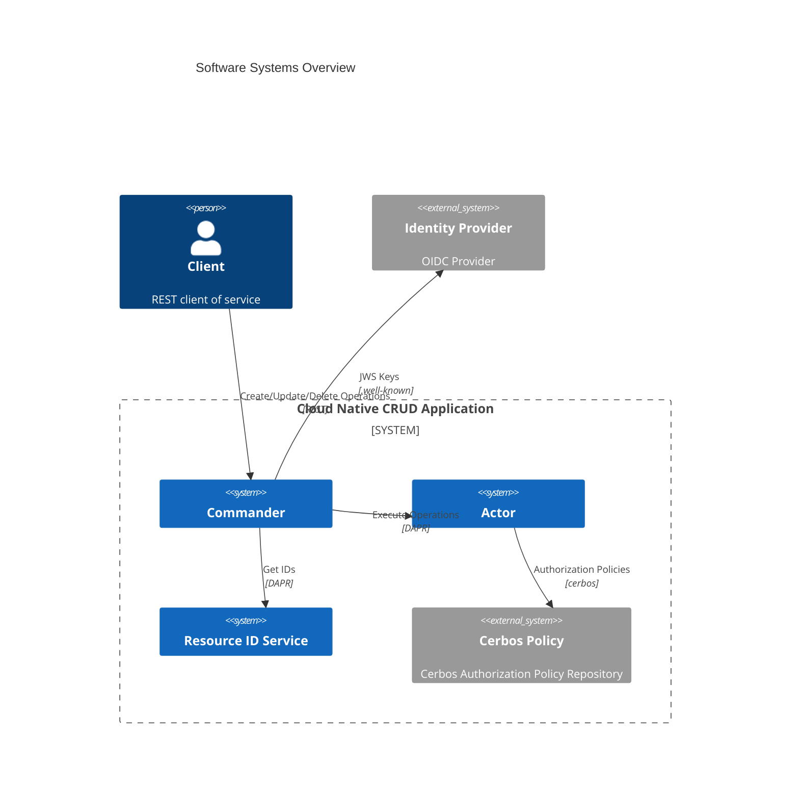
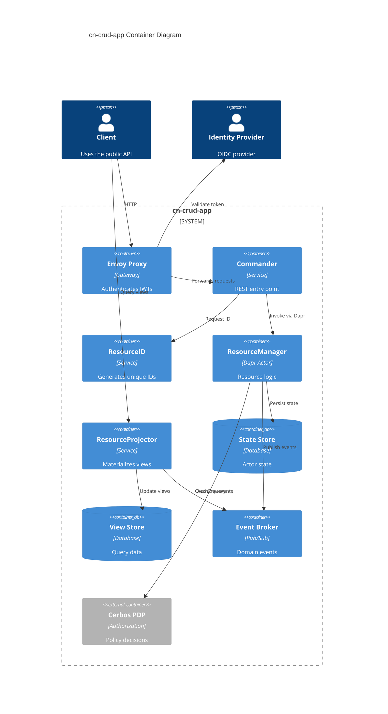
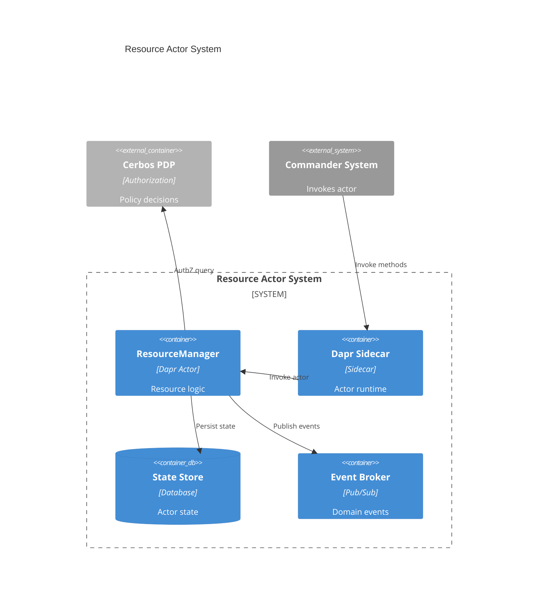
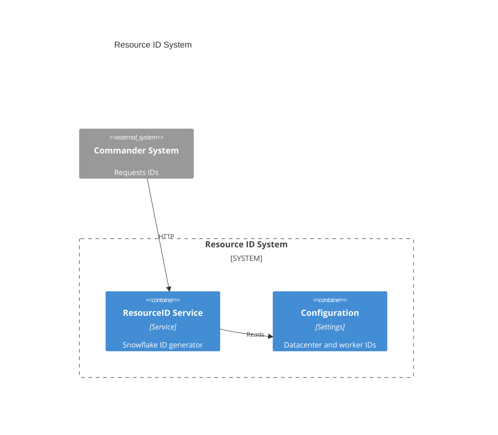

# Architecture Diagrams

The following diagrams describe the cn-crud-app using the C4 model.

## System Context

## Software Systems Overview

## Commander Requests Unique IDs

## Container Overview

## Commander System

## Resource Actor System

## Resource ID System

