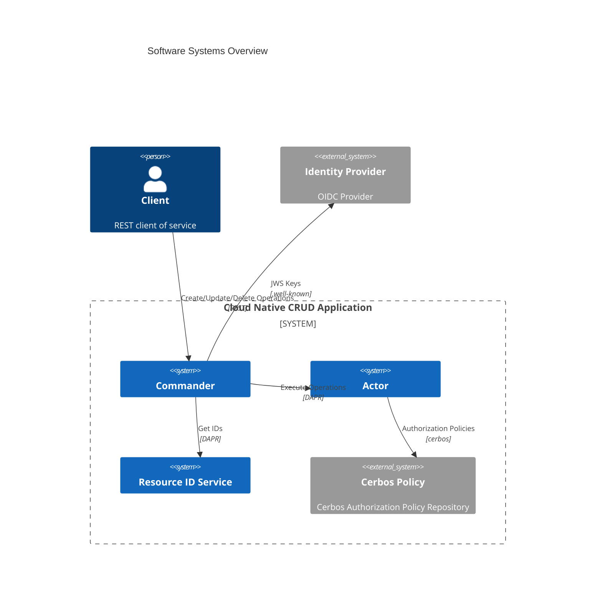
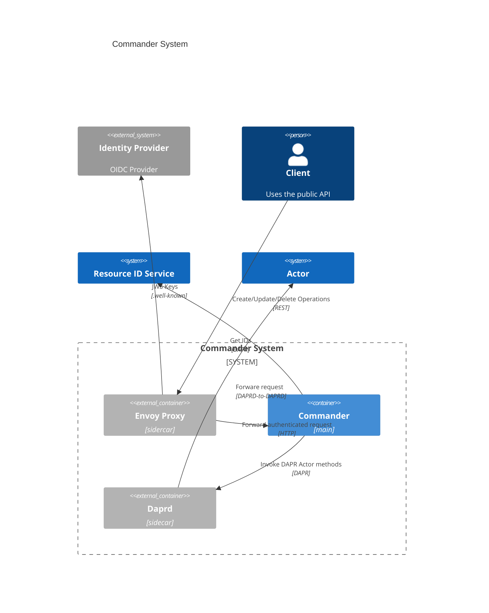
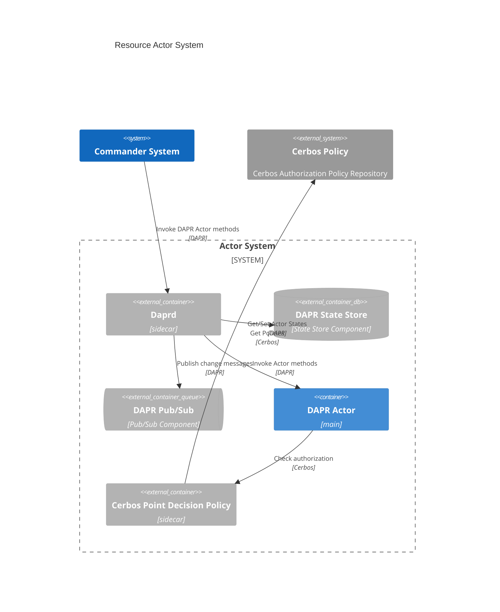

# Architecture Diagrams

The following diagrams describe the cn-crud-app using the C4 model.

## System Context


## Software Systems Overview



## Commander System



## Resource Actor System



## Resource ID System

```mermaid
%%{init: {'theme': 'default'}}%%
C4Container
title Resource ID System
```
